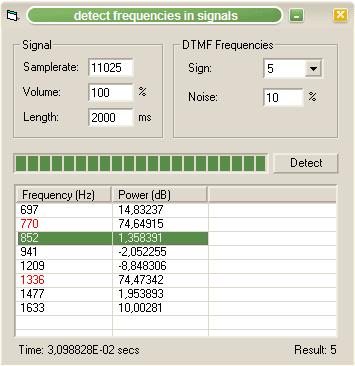



## frequency detection \(DTMF\)

### Description

This is just a little demonstration on how to do frequency detection on digital audio signals.

You can generate a signal from a DTMF sign (numbers, chars), which consists of 2 frequencies,

and the program will detect it by using a G&#246;rtzel algorithm.

Frequencies + Detection musn't always mean FFT.

Sometimes there are faster ways.
 
### More Info
 

             |
---                |---
**Submitted On**   |2006-06-14 19:50:02
**By**             |[Arne Elster](https://github.com/Planet-Source-Code/PSCIndex/blob/master/ByAuthor/arne-elster.md)
**Level**          |Intermediate
**User Rating**    |5.0 (30 globes from 6 users)
**Compatibility**  |VB 6\.0
**Category**       |[Sound/MP3](https://github.com/Planet-Source-Code/PSCIndex/blob/master/ByCategory/sound-mp3__1-45.md)
**World**          |[Visual Basic](https://github.com/Planet-Source-Code/PSCIndex/blob/master/ByWorld/visual-basic.md)
**Archive File**   |[frequency\_2000906142006\.zip](https://github.com/Planet-Source-Code/arne-elster-frequency-detection-dtmf__1-65667/archive/master.zip)

